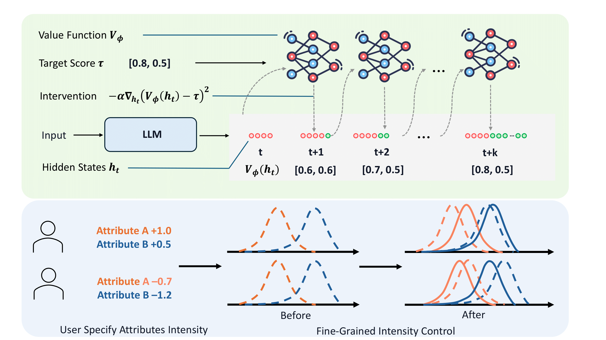

<h1 align="center">PRE-CONTROL: Precise Attribute-Intensity Control for LLMs via Targeted Representation Editing</h1>

<p align="center">
  <a href="https://arxiv.org/abs/25xx.xxxxx"></a>
  <a href="https://github.com/liqinye/pre-control/stargazers"></a>
</p>

`PRE-CONTROL` reformulates alignment as a **target-reaching** problem.  
Instead of merely pushing an attribute _up_ or _down_, we **steer hidden states during decoding** so the generated text lands at a user-specified intensity (e.g. *helpfulness = 0.7, complexity = 0.3*).

Key ingredients  
* **Value Function ($V_\phi$)** – predicts final attribute scores from partial generations (trained with TD-λ).  
* **Gradient Intervention** – edits the last-layer hidden state to minimise $(V_\phi - \tau)^2$ at every step.  
* **Multi-attribute support** &nbsp;→ efficient Pareto-frontier exploration and controllable data distillation.

<p align="center">
  
</p>


## Table of Contents
1. [Installation](#installation)
2. [Quick Start](#quick-start)
3. [Datasets](#datasets)
4. [Citation](#citing-pre-control)

---

## Installation
```bash
# ⚙️ Conda (recommended)
conda create -n pre-control python=3.10
conda activate pre-control
pip install -r requirements.txt
```

---
## Quick Start
1. Generate value function training data
```
bash scripts/get_vf_train_dataset.sh 
bash scripts/get_vf_train_dataset_labels.sh # label with reward model
```
2. Train the Value Function
```
bash scripts/train_vf.sh
```
3. Precise Control at Inference
```
bash scripts/run_inference_intervention.sh   # edited vs. vanilla generations
bash scripts/get_vf_edited_response_scores.sh
```
4. Evaluation
```
python src/metrics.py
```
---

## Dataset

| Dataset                | #Samples | Attributes (5×)                                                               | Source                |
| ---------------------- | -------- | ----------------------------------------------------------------------------- | --------------------- |
| [**HelpSteer2**](https://huggingface.co/datasets/nvidia/HelpSteer2)         | 20k     | helpfulness, correctness, coherence, complexity, verbosity                    | Wang *et al.* 2024    |
| [**Code-UltraFeedback**](https://huggingface.co/datasets/coseal/CodeUltraFeedback) | 10k     | explanation, complexity+efficiency, readability, style, instruction-following | Weyssow *et al.* 2024 |


## Citation

